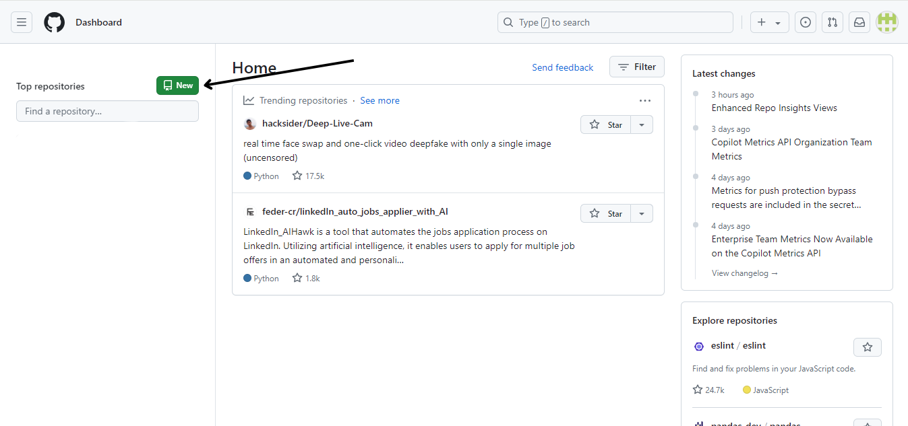
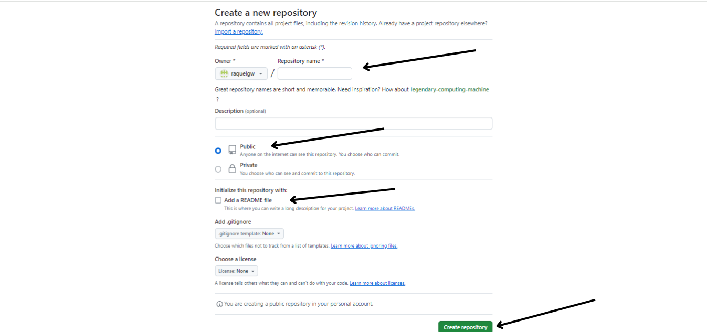
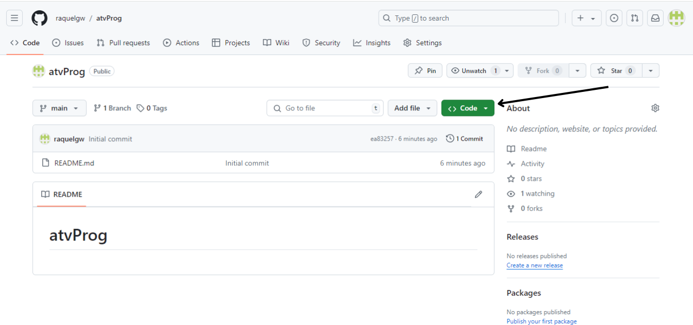
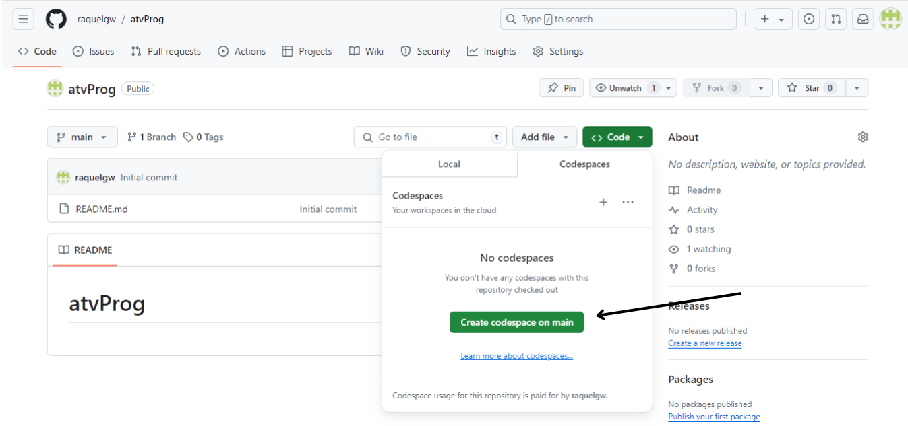
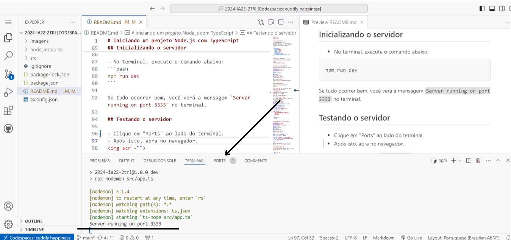
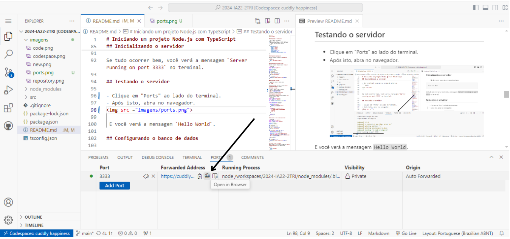

# Iniciando um projeto Node.js com TypeScript


### Crie uma conta no GitHub:
- Se você ainda não tem uma conta, acesse github.com e crie uma.


### Crie um Repositório no GitHub:
No GitHub, clique no botão New para criar um novo repositório.

- Dê um nome ao seu repositório.
- Selecione a opção **Public** (para que todos possam ver).
- Clique em “adicionar um arquivo README” caso queira escrever uma descrição para seu projeto.
- Clique em **Create repository**.

- Após criar um repositório clique em “<> code”

- Clique em “Create codespace on main” para iniciar o projeto.

- Abra o terminal com o comando CTRL + ‘
- Execute os seguintes comandos no terminal para configurar o projeto:


```bash
npm init -y
npm install express cors sqlite3 sqlite
npm install --save-dev typescript nodemon ts-node @types/express @types/cors
npx tsc --init
mkdir src
touch src/app.ts
```


## Configuranado o `tsconfig.json`


- Abra o arquivo tsconfig.json.
- Altere "outDir": "./", para "outDir": "./dist",.
- Adicione "rootDir": "./src", logo abaixo.
- Remova os // das linhas e adicione uma vírgula após cada linha.
- O arquivo final deve parecer com isto:


```json
{
  "compilerOptions": {
    "target": "ES2017",
    "module": "commonjs",
    "outDir": "./dist",
    "rootDir": "./src",
    "strict": true,
    "esModuleInterop": true,
    "skipLibCheck": true,
    "forceConsistentCasingInFileNames": true
  }
}
```


## Configurando o `package.json`

- Adicione o seguinte script ao seu `package.json` dentro de "scripts":


```json
  "dev": "npx nodemon src/app.ts"
```

(Adicione uma vírgula na linha que está acima da linha que você acabou de adicionar)

## Criando arquivo inicial do servidor


- Adicione o seguinte código ao arquivo `src/app.ts`


```typescript
import express from 'express';
import cors from 'cors';
import { connect } from './database';

const port = 3333;
const app = express();

app.use(cors());
app.use(express.json());

app.get('/', (req, res) => {
  res.send('Hello World');
});

app.post('/users', async (req, res) => {
  const db = await connect();
  const { name, email } = req.body;

  const result = await db.run('INSERT INTO users (name, email) VALUES (?, ?)', [name, email]);
  const user = await db.get('SELECT * FROM users WHERE id = ?', [result.lastID]);

  res.json(user);
});

app.get('/users', async (req, res) => {
  const db = await connect();
  const users = await db.all('SELECT * FROM users');

  res.json(users);
});

app.put('/users/:id', async (req, res) => {
  const db = await connect();
  const { name, email } = req.body;
  const { id } = req.params;

  await db.run('UPDATE users SET name = ?, email = ? WHERE id = ?', [name, email, id]);
  const user = await db.get('SELECT * FROM users WHERE id = ?', [id]);

  res.json(user);
});

app.delete('/users/:id', async (req, res) => {
  const db = await connect();
  const { id } = req.params;

  await db.run('DELETE FROM users WHERE id = ?', [id]);

  res.json({ message: 'User deleted' });
});

app.listen(port, () => {
  console.log(`Server running on port ${port}`);
});
```

## Configurando o banco de dados

Crie um arquivo ` database.ts ` dentro da pasta ` src ` e adicione o seguinte código.

``` import { open, Database } from 'sqlite';
import sqlite3 from 'sqlite3';

let instance: Database | null = null;

export async function connect() {
  if (instance !== null) 
      return instance;

  const db = await open({
     filename: './src/database.sqlite',
     driver: sqlite3.Database
   });
  
  await db.exec(`
    CREATE TABLE IF NOT EXISTS users (
      id INTEGER PRIMARY KEY AUTOINCREMENT,
      name TEXT,
      email TEXT
    )
  `);

  instance = db;
  return db;
}
```

## Inicializando o servidor


- No terminal, execute o comando abaixo:
```bash
npm run dev
```

Se tudo ocorrer bem, você verá a mensagem `Server running on port 3333` no terminal.

## Testando o servidor


- Clique em "Ports" ao lado do terminal.
- Após isto, abra no navegador.




 E você verá a mensagem `Hello World`.

## Configuranado o HTML

- Adicione este código no arquivo **index.html**


```
<!DOCTYPE html>
<html lang="pt-BR">

<head>
  <meta charset="UTF-8">
  <meta name="viewport" content="width=device-width, initial-scale=1.0">
  <title>Cadastro de Usuários</title>
  <style>
    table {
      width: 100%;
      border-collapse: collapse;
      margin-top: 20px;
    }

    table, th, td {
      border: 1px solid #ddd;
    }

    th, td {
      padding: 8px;
      text-align: left;
    }

    th {
      background-color: #f4f4f4;
    }

    button {
      margin: 0 5px;
    }
  </style>
</head>

<body>
  <h1>Cadastro de Usuários</h1>

  <form id="userForm">
    <input type="text" name="name" placeholder="Nome" required>
    <input type="email" name="email" placeholder="Email" required>
    <button type="submit">Cadastrar</button>
  </form>

  <table>
    <thead>
      <tr>
        <th>Id</th>
        <th>Nome</th>
        <th>Email</th>
        <th>Ações</th>
      </tr>
    </thead>
    <tbody id="userTableBody">
      <!-- Conteúdo será inserido aqui -->
    </tbody>
  </table>

  <script>
    document.addEventListener('DOMContentLoaded', () => {
      const form = document.getElementById('userForm');
      const tbody = document.getElementById('userTableBody');

      form.addEventListener('submit', async (e) => {
        e.preventDefault();

        const formData = new FormData(form);
        const name = formData.get('name');
        const email = formData.get('email');

        await fetch('/users', {
          method: 'POST',
          headers: { 'Content-Type': 'application/json' },
          body: JSON.stringify({ name, email })
        });

        form.reset();
        loadUsers();
      });

      async function loadUsers() {
        const response = await fetch('/users');
        const users = await response.json();

        tbody.innerHTML = '';

        users.forEach(user => {
          const row = document.createElement('tr');
          row.innerHTML = `
            <td>${user.id}</td>
            <td>${user.name}</td>
            <td>${user.email}</td>
            <td>
              <button class="delete">Excluir</button>
              <button class="edit">Editar</button>
            </td>
          `;

          row.querySelector('.delete').addEventListener('click', async () => {
            await fetch(`/users/${user.id}`, { method: 'DELETE' });
            row.remove();
          });

          row.querySelector('.edit').addEventListener('click', async () => {
            const newName = prompt('Novo nome:', user.name);
            const newEmail = prompt('Novo email:', user.email);

            if (newName && newEmail) {
              await fetch(`/users/${user.id}`, {
                method: 'PUT',
                headers: { 'Content-Type': 'application/json' },
                body: JSON.stringify({ name: newName, email: newEmail })
              });

              loadUsers();
            }
          });

          tbody.appendChild(row);
        });
      }

      loadUsers();
    });
  </script>
</body>

</html>

```
